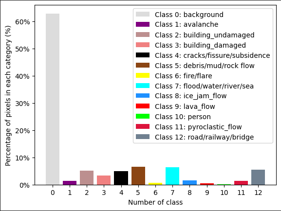
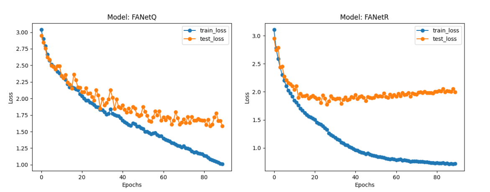

## Engineering Project
This projects contains of two approaches to neural networks, a potential gamechanger - **Quaternion Neural Network**, and a well known **Real Valued Neural Network**. Implementing these two models exhibits the differences between the performance on a task of pixel classification in 
disaster events.

# Dataset
[LPCVAI2023](https://lpcv.ai/2023LPCVC/introduction)

# Labels
The model contains 13 classes seen below on the chart, additionaly containing the class distribution of each pixel from the ground-truth images. 

# Metrics
Weighted-Cross-Entropy 
Dice Coefficient

# Results
Trainable parameters:
|       Quaternion Neural Network        |   Real Valued Network   |   Difference   |
|:--------------------------------------:|:-----------------------:|:--------------:|
|              11 880 664               |        13 968 256        |     2 087 592  |

Training and testing phase values for cross-entropy throughout epochs:

